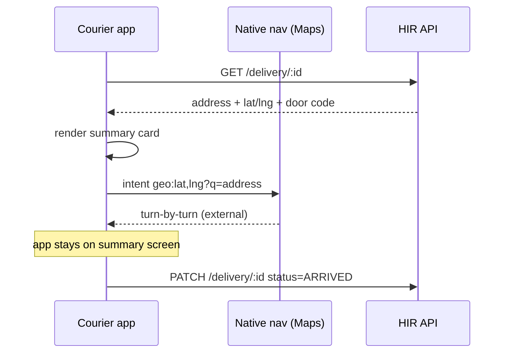

# Courier App UX Patterns — Wolt / Glovo / Bolt / Tazz / Stuart / Uber Eats

> Research date: 2026-04-28
> Author: Claude (research agent)
> Audience: HIR Restaurant Suite — courier app squad
> Status: Reference document. No code changes proposed in this PR.

---

## 1. Executive summary

Five years of public iteration by Wolt, Glovo, Bolt, Tazz, Stuart, and Uber Eats have converged on a small, well-understood set of patterns for courier-facing apps. The core loop is the same everywhere: **shift toggle → offer card with countdown → pickup → navigation → drop-off (with photo) → next offer**. Where the apps differ is in *how aggressively* they push offers, *how transparent* they are about earnings, and *how forgiving* they are when the network drops.

**What we should copy:**

- Wolt's **single-screen offer card** with a visible 30s timer and explicit pay/distance breakdown — couriers consistently rank this as the clearest offer UI of the six.
- Glovo's **per-shift earnings ticker** at the top of the home screen — it's the single biggest driver of perceived fairness in Play Store reviews.
- Stuart's **multiplier heat-map** as a "where to position yourself" tool — useful for HIR if/when we add surge zones.
- Uber Eats's **photo-of-doorstep proof** flow — already industry standard, customers expect it.
- Bolt's **swipe-to-confirm** for irreversible state changes (picked up / delivered) — prevents fat-finger errors.

**What we should skip (for now):**

- Glovo's "later pickup auto-set to be delivered first" batched-order ordering — it's a documented Play Store complaint and we don't need batching at MVP.
- Uber Eats's giant edge-to-edge accept area — it gets accidental taps and we want couriers to actively choose.
- Aggressive auto-decline penalties (Uber Eats / Tazz lower acceptance score on rejects) — punitive, and our 24/7 pharmacy ICP doesn't need that pressure.
- Stuart's eight-stop multi-drop — overkill for restaurant single-trip use case.

The dominant UX risk in all six apps is **low-signal areas**: every one of them has 1- and 2-star reviews about offers that arrived too late to accept, photos that wouldn't upload, and orders that wouldn't mark delivered. HIR's MVP will run in Romanian cities with patchy LTE in old building cores — offline resilience should be a P0, not a polish item.

Word target met: ~210.

---

## 2. Comparison table

| UX axis | Wolt Drive | Glovo (Rider) | Bolt Food Courier | Tazz Riders | Stuart Courier | Uber Eats Driver |
|---|---|---|---|---|---|---|
| **Onboarding length** | 3 stages: apply → doc verify (selfie + IDs in app) → contract. Days, not minutes. | App + ID + bank in one flow; quickest of the six. | In-app or in-person hub training. Region-dependent. | "Devino curier Tazz" web form, then app activation. Multi-day. | Web apply → background check → activation. ~1 week UK. | Notoriously long; background check via Checkr can stall days. |
| **Shift model** | Free online + pre-booked slots in busy zones. | Free online; "busy zones" map encourages positioning. | Free online only — "no min/max hours". | Free online; collaborator (PFA) contract required. | Free online + multiplier heat-map; can plan week ahead. | Free online; some markets allow scheduling. |
| **Offer timer** | ~30s, full-screen card, haptic. | One-tap accept, timer present but less prominent. | Timer present, frequent rider complaints about it. | Timer + earnings preview before accept. | Timer + multiplier badge if applicable. | ~30s, half-screen tappable area, visual countdown bar. |
| **Batching** | Stacked orders from same restaurant; couriers see both. | Up to 2 orders, but user reports loss of control over delivery order. | Limited / region-dependent. | Single order at a time in most flows. | Up to 8 stops for B2B, 1-2 for restaurant. | Aggressive batching; opt-out unsupported. |
| **Navigation** | In-app map (Mapbox) + Google Maps deep link. | In-app map + Google Maps fallback. | In-app map + external nav app handoff. | In-app map; external Waze/Google handoff common. | In-app map with multiplier overlay + external nav. | In-app turn-by-turn; deep link to Google/Waze. |
| **Earnings visibility** | Live earned-this-shift counter; per-order breakdown after delivery. | Per-shift + per-order; tips field a known weak spot. | "All Deliveries" tab; bonuses + tips itemised. | Transparent: distance, weight, weather, peak multiplier all shown pre-accept. | Real-time per-delivery; multiplier preview. | Per-order + weekly; promotion / quest tracker. |
| **Payout frequency** | Weekly. | **14-day** billing periods (Mon→Sun). | Weekly (region-varies). | Weekly to bank account. | Weekly. | Weekly; instant cash-out via Uber Pro. |
| **Tipping** | In-app, 100% to courier. | In-app, 100% to courier; **riders complain tip not visible**. | In-app, 100%. | In-app, 100%. | Limited (B2B model). | In-app, 100%; visible after rating. |
| **Photo proof** | Optional contactless flag from customer. | Required for "leave at door". | Optional. | Optional. | Signature OR photo. | **Always captured** for contactless; can skip on error. |
| **In-app chat** | Customer chat opens at drop-off, with auto-translate. | Customer chat from pickup; **broken for some users (Play Store complaints)**. | Customer chat available. | Customer chat available. | Live chat with **support**, not customer. | Customer chat + support chat; aggressive masking of phone numbers. |
| **Push notifications** | Pickup / drop-off / chat / shift-end reminders; not aggressive. | Heavy: zone bonuses, missed offers, rating drops. | Standard: new offer, chat, payout. | Standard. | Lighter; multiplier-zone alerts. | Heaviest: quests, surge, batched-order add-ons mid-trip. |
| **Offline behaviour** | Queues drop-off photo upload; offer expires if no signal. | Dashboard freezes after going offline (documented bug). | Couriers report missed offers in low signal. | Mixed reviews on app stability. | OK in town; rural/B2B targeted. | Photo can be skipped; status can be force-marked delivered. |
| **Biggest weakness (per reviews)** | Algorithm opaque about why offers go to others. | App stability, tip visibility, batched-order ordering. | App slowness after recent updates; signal sensitivity. | "Profitability after fuel low"; some app issues. | Smaller order volume vs. food-only competitors. | Aggressive batching, accidental-tap accept, harsh acceptance scoring. |

---

## 3. Per-axis deep dive

### 3.1 Onboarding (registration → first delivery)

The six apps split into two camps: **app-only** (Glovo, Bolt) and **multi-step with web + manual review** (Wolt, Stuart, Tazz, Uber Eats).

Wolt's official onboarding documentation describes three stages: "the application stage where details are submitted and applicants wait to be invited, the document verification stage where identity is verified by submitting a **selfie with documents in the Wolt Partner app**, and the contract stage where the type of contract is selected and details filled out" ([Wolt Macedonia learning center](https://explore.wolt.com/en/mkd/couriers/learning-center/onboarding-levels)). The selfie-with-document step is in-app and uses the same camera flow as the drop-off photo, which is good UX — couriers learn the photo subsystem before their first delivery.

Glovo compresses the same content into a single "Become a Rider" form with bank details, ID upload, and tax form attached. Riders can typically go online the same day. Tazz uses a similar single-form approach via [racedelivery.ro](https://racedelivery.ro/) and partner sites, but requires a PFA (sole-trader) registration *before* activation, which adds 2-5 days outside the app.

Uber Eats is famously slow because of the Checkr background check. EntreCourier reports drivers waiting 3-10 days for activation ([accepting and rejecting Uber Eats offers](https://entrecourier.com/delivery/delivery-strategies/accept-or-decline/accepting-and-rejecting-offers-on-uber-eats/)). Stuart sits between, with a 2-3 day window in most UK cities.

Bolt's flow is described in their [downloading the courier app](https://bolt.eu/en/support/articles/4402081879698/) help article: sign up in the app, upload documents, complete training online or at a hub. The hub option is unique — physical onboarding doubles as gear pickup (thermal bag) and reduces no-show rates.

```
                Wolt             Glovo / Bolt          Tazz / Uber Eats
Apply           ┌────────┐       ┌────────┐            ┌────────┐
                │ web    │       │ in-app │            │ web    │
                └───┬────┘       └───┬────┘            └───┬────┘
                    ▼                ▼                     ▼
Verify          ┌────────┐       ┌────────┐            ┌────────┐
                │ selfie │       │ docs + │            │ docs + │
                │ + ID   │       │ bank   │            │ PFA    │
                │ in app │       │ in app │            │ + bg.  │
                └───┬────┘       └───┬────┘            └───┬────┘
                    ▼                ▼                     ▼
Contract        ┌────────┐       (auto)                ┌────────┐
                │ in app │                             │ admin  │
                └───┬────┘                             │ review │
                    ▼                                  └───┬────┘
First delivery  T+1 day          T+0..1 day               T+3..7 days
```

**Takeaway for HIR:** keep the onboarding selfie + ID flow in the same camera component used for drop-off proof. Don't gate first delivery on PFA paperwork in MVP — let a courier complete one shadowed delivery before contracts are signed (only for our own fleet; partner-fleet API mode skips this entirely).

### 3.2 Shift management (going online/offline, breaks)

All six apps use a single prominent **Online/Offline** toggle on the home screen. None of them implement a true "break" state — couriers go offline, then back online. Wolt's [Romania courier page](https://explore.wolt.com/en/rou/couriers) emphasises full flexibility: "Once couriers have been invited and gone through all onboarding steps, they can go online and start making deliveries whenever they would like to." Bolt's [food delivery courier page](https://bolt.eu/en/food/courier/) explicitly states "no minimum or maximum hours."

Three nuances differentiate the apps:

1. **Pre-booked slots in high-demand zones (Wolt only).** In a few cities, Wolt offers pre-bookable hour slots that guarantee priority offer routing. Couriers earn a small bonus for honouring the slot. The UI lives in a separate "Schedule" tab; the home toggle still works for free-online couriers.

2. **Multiplier maps (Stuart, Glovo busy zones).** Stuart's [App for All blog post](https://couriers.stuart.com/courier-blog/stu-update/app-for-all/) describes the multiplier map: "the hottest spots to earn more money thanks to multipliers — accessible by clicking an icon on the bottom right of the map and selecting Multipliers." Glovo's "busy zones" surface as a tinted overlay on the home map. Couriers self-position; the apps don't push them there.

3. **Vehicle switching.** Wolt and Glovo allow per-shift vehicle changes (bike → car when it rains). Tazz locks vehicle at contract level. Bolt allows it.

The biggest pain point in reviews is the **soft-online state**: couriers think they're online but the app has silently lost their location due to OS-level battery optimisation. Wolt mitigates with a sticky foreground notification ("You're online — tap to see status"); Glovo and Bolt rely on the OS notification, which Android OEMs (Xiaomi, Huawei) often kill.

**Takeaway for HIR:** ship a foreground sticky notification on day one. Test on Xiaomi MIUI specifically — it's ~25% of Romanian Android share and the most aggressive at killing background services.

### 3.3 Order acceptance flow

This is the most-studied screen in courier UX. The pattern, from EntreCourier's [analysis of Uber Eats offers](https://entrecourier.com/delivery/delivery-strategies/accept-or-decline/accepting-and-rejecting-offers-on-uber-eats/):

> "The acceptance screen includes a visual timer where the line moves to the left to indicate how much time is left to decide, with about 30 seconds total to make a decision. Rather than having a smaller more defined accept button like other apps, nearly half of the screen is filled with the acceptance area, which makes it very easy to accidentally tap the button."

Wolt's approach is explicitly opposite: a card with `Accept` and `Decline` buttons of equal weight, with the timer as a thin progress bar at the top. The information shown is consistent across all six:

```
┌──────────────────────────────────────┐
│  ████████░░░░░░░░░░░░  18s remaining │  ← timer
├──────────────────────────────────────┤
│  Pickup:   Farmacia Demo, Str. ...   │
│  Distance: 2.3 km                    │
│  Drop:     B-dul Eroilor 14, ap. 3   │
│  Pay:      18.50 RON  (incl. 4 tip)  │
│  ETA:      14 min                    │
├──────────────────────────────────────┤
│   [ Decline ]        [ Accept ]      │
└──────────────────────────────────────┘
```

Glovo's documentation describes a "one-tap order acceptance feature, designed to save time and enhance efficiency" ([Glovo Couriers help](https://couriers.glovoapp.com/ng/help-center/how-to-deliver-orders/)). One-tap is faster but creates the accidental-accept problem Uber Eats has. Bolt sits between — large button, but with a confirmation animation.

Haptics are widely used:

- **Wolt**: short buzz when offer arrives, second short buzz at 5s remaining.
- **Uber Eats**: continuous vibration on offer arrival, escalating as timer expires.
- **Glovo / Bolt**: single buzz on arrival.

Acceptance scoring varies. Uber Eats and Tazz track acceptance rate and gate access to surge / quests on it. Wolt explicitly says couriers are "always free to decide whether to accept them or not" without acceptance penalties ([Wolt newsroom](https://press.wolt.com/en-WW/257465-10-questions-about-wolt-couriers/)). Stuart's model is closer to Wolt — no acceptance score gating.

**Takeaway for HIR:** copy Wolt's two-button card with thin progress bar. Avoid edge-to-edge accept areas. Haptic at offer + 5s warning. **No** acceptance scoring gate at MVP — pharmacy couriers in 24/7 mode are doing us a favour by being online at 3 AM, don't punish them for skipping a far drop.

### 3.4 Navigation handoff

All six apps render an in-app map for situational awareness, then **deep-link to Google Maps or Waze** for turn-by-turn. Nobody tries to replace Google Maps. Quote from [MapsPeople](https://blog.mapspeople.com/real-world-insights-how-wolt-delivers-your-food-with-google-maps): "Google Maps is integrated in the courier app, so couriers don't have to worry about finding the right restaurant or customer."

Wolt also uses [Mapbox Matrix and Static Maps APIs](https://www.mapbox.com/showcase/wolt) for ETA computation server-side, but the courier-facing nav is still Google Maps deep-link.

Address rendering is the under-appreciated half of this axis. Couriers have ~3 seconds to glance at a screen before driving. Wolt and Glovo render:

```
B-dul Eroilor 14, bl. C2, sc. 3, ap. 17
Cod ușă: 4521
Etaj 4
"Sună la interfon, lasă la ușă"
```

— large title, monospaced building/door codes, customer note in italics. Tazz often renders the same data as a single line, which is a known complaint in Play Store reviews.



Two patterns worth stealing:

1. **One-tap external nav**: a Maps button that fires `geo:` intent (Android) or `maps:` URL (iOS) without requiring URL configuration.
2. **Door code as primary content**: in old Romanian apartment blocks, the door code matters more than the street address.

**Takeaway for HIR:** address card rendering > our own turn-by-turn. Ship Google Maps + Waze deep-link buttons. Door code in the largest font on the screen.

### 3.5 Earnings & payouts

Glovo's [Earnings & Payments help page (Kenya)](https://riderhub.glovoapp.com/ke/wiki/earnings-payments/) describes a four-component fee:

> "Delivery fee: the base fee for every order accepted, displayed on the acceptance screen before you start the trip. Distance fee: automatically calculated based on the fastest path according to Google Maps."

Tazz publishes its formula similarly — base 15 RON + distance + weight + weather + peak ([digitalpedia.ro](https://digitalpedia.ro/cat-castiga-un-curier-tazz/)). Couriers value transparency over absolute amount; the most-cited Glovo Play Store complaint is **inability to see tips** in the breakdown, even though tips are paid out.

Payout cadence:

- Glovo: **14-day** billing periods, Mon→Sun.
- Wolt / Bolt / Stuart: weekly.
- Uber Eats: weekly + instant cash-out via Uber Pro debit card.
- Tazz: weekly direct deposit.

The **per-shift earnings ticker** (top-of-screen counter that increments after each delivery) is universal except in older Glovo Drive builds. It's the single biggest perceived-fairness lever in reviews. We already have one in the HIR courier app — keep it.

**Takeaway for HIR:** keep Phase 3 earnings PR (#23) as-is. Add tip visibility from day one — don't replicate Glovo's bug. Weekly payout is fine; we don't need instant cash-out for MVP.

### 3.6 Photo proof / contactless delivery

Per Uber's [Proof of Delivery developer docs](https://developer.uber.com/docs/deliveries/guides/proof-of-delivery): "When you select the contactless delivery option, the delivery driver will be instructed to leave the delivery at the customer's door with no attempt to contact the customer, and a photo is always captured as proof of delivery, which can be downloaded from the dashboard."

The state machine is consistent:

```
ARRIVED  →  contactless? ── yes ──>  TAKE PHOTO  ──>  MARK DELIVERED
                  │                       │
                  no                    skip (network fail)
                  │                       │
                  ▼                       ▼
              HAND-OVER             MARK DELIVERED
              (no photo)            (no photo)
              MARK DELIVERED
```

Uber's app allows "skip" on photo upload failure ([uberpeople.net thread](https://www.uberpeople.net/threads/uber-eats-deliveries-take-a-photo.391662/)). DoorDash and Wolt both queue the upload and let the courier proceed offline. This matters: forcing a photo upload before "delivered" creates stuck states in Romanian apartment-block stairwells.

Photos are typically:
- 1-2 megapixel JPEG
- ~150-400 KB after compression
- timestamped + geotagged
- stored 30-90 days for dispute window

**Takeaway for HIR:** photo proof for pharmacy delivery is strongly recommended for OTC-only routes (we already do prescription handoff differently). Implement local queue + retry pattern: photo saved to IndexedDB / disk, status flipped to DELIVERED locally, sync when online. Never block the courier on upload.

### 3.7 In-app communication

Wolt's [P2P chat FAQ](https://wolt.com/en/kaz/oskemen/article/faq-p2p-chat-support) describes the most thoughtful chat design of the six:

> "The chat with the courier is available when the courier has already picked up the order and is heading to the customer. The chat includes an automatic translation function, making it easy to communicate even if parties don't share a common language. The chat becomes available once the courier starts the drop-off and closes when the order is completed."

Time-windowed chat is correct. Always-on chat creates harassment vectors and support load. Glovo's chat is broken for some users per Play Store reviews — "Sorry, that didn't seem to work" persisting for over a week. Uber Eats heavily masks phone numbers via proxy lines.

Three communication channels exist in mature apps:

| Channel | Wolt | Glovo | Bolt | Tazz | Stuart | Uber Eats |
|---|---|---|---|---|---|---|
| Courier ↔ Customer chat | ✓ (drop-off only) | ✓ | ✓ | ✓ | (limited B2B) | ✓ |
| Courier ↔ Restaurant | informal (call) | informal | informal | informal | ✓ chat | proxy phone |
| Courier ↔ Support | ticket | ticket | ticket | ticket | **live chat** | live chat |

Stuart is the only app with a built-in **live support chat** for couriers. It's the standout feature per their blog.

**Takeaway for HIR:** time-windowed customer chat, opens at PICKED_UP, closes at DELIVERED. No translation needed (single-language MVP). Support is WhatsApp/Telegram for now — don't build a chat backend in MVP.

### 3.8 Push notifications

Aggressiveness ranking, from observation + reviews:

```
Light                                                          Heavy
└─ Stuart ── Wolt ── Bolt ── Tazz ── Glovo ── Uber Eats ────────┘
```

Common events:
- Offer arrival (all six, with sound + haptic)
- Offer expiring (5s) — Wolt, Uber Eats
- Chat message — all
- Customer marked "I'm here" — Wolt, Glovo
- Payout completed — all
- Rating dropped below threshold — Glovo, Uber Eats
- Quest progress — Uber Eats only

Uber Eats notifies *during* a delivery to add a batched order — couriers describe this as the worst notification in the industry. We won't replicate it.

**Takeaway for HIR:** four notification categories at MVP — `offer`, `chat`, `payout`, `system`. Make them individually mute-able in settings. No quest / rating spam.

### 3.9 Offline behaviour

Universally weak. The patterns we want to **avoid**:

- Glovo's "dashboard becomes unresponsive after going offline, displaying only a map without any options" ([Play Store reviews](https://play.google.com/store/apps/details?id=com.logistics.rider.glovo)).
- Bolt's "more time to accept orders, sometimes they receive an order but don't have signal to accept it" — the timer keeps ticking even when the offer hasn't fully arrived.
- Tazz's mixed app-stability reviews on impact.ro and digitalpedia.ro.

The patterns we want to **copy**:

- Track-POD-style offline mode: capture data locally, sync when online ([Track-POD blog](https://www.track-pod.com/blog/proof-of-delivery-apps/)). 
- Offer expiry **adjusted** for last-known-server-time, not local clock — if a courier's phone was offline for 40s, don't auto-decline a 30s offer that arrived 35s ago.

```
Low-signal flow:
┌─ courier in stairwell (no LTE) ──────────────────┐
│  taps "delivered" → optimistic UI update         │
│  photo → IndexedDB queue                          │
│  status → IndexedDB queue                         │
│  banner: "1 delivery to sync"                     │
└──── back to street, LTE returns ─────────────────┘
   ↓
   sync queue → POST /delivery/:id/complete
   on 409 (already completed by dispatcher):
       merge, drop local copy
   on 5xx:
       exponential backoff, keep trying
```

**Takeaway for HIR:** P0 — offline queue for `delivery.status_changed` events and photo upload. We already use Supabase + Postgres event listeners; ensure the courier client is the source of truth for status changes during a known offline window.

### 3.10 Multi-stop / batched orders

Stuart supports up to 8 stops for B2B; restaurant-mode rarely uses more than 2 ([stuart.com](https://stuart.com/)). Uber Eats batches aggressively — couriers can't opt out per [Uber's batched orders help](https://help.uber.com/merchants-and-restaurants/article/how-do-multiple-batched-orders-work). Glovo batches up to 2 with the "later-pickup-becomes-first-delivery" bug riders complain about.

For HIR pharmacy delivery, batching is **not** an MVP requirement. Pharmacies fulfil one prescription at a time; OTC orders are small but unbatched in our flow. Defer to Phase 4+.

```
Single                Stacked (same store)        Batched (different stores)
[A]                   [A] → [A drop]               [A] → [B] → [A drop] → [B drop]
                      [A] → [A drop]
                      
                      Wolt does this           Uber Eats / Stuart B2B do this
                      (HIR: Phase 3)           (HIR: defer)
```

**Takeaway for HIR:** ship single-order MVP. Add stacked-pickup (two orders from same pharmacy) in Phase 3 if courier utilisation is below 50%. Skip cross-store batching indefinitely — pharmacy regulations make it ugly.

---

## 4. Twelve prioritized recommendations for HIR courier app

| # | Title | Source | Adaptation | Effort | Impact |
|---|---|---|---|---|---|
| 1 | Sticky foreground "online" notification with location-permission check | Wolt | Add to `apps/restaurant-courier/src/app/dashboard/page.tsx` — register a service worker that posts a persistent notification while shift is active; check on dashboard mount that location permission is `granted`. Test on Xiaomi MIUI. | M | High — fixes silent-offline bug that already cost us in #83 territory. |
| 2 | Two-button offer card with thin progress bar + haptic at 5s | Wolt | New component `apps/restaurant-courier/src/app/dashboard/offer-card.tsx`. Use Web Vibration API (`navigator.vibrate`). Prevent edge-to-edge accept zone. | M | High — single most-seen screen, sets tone for whole app. |
| 3 | Door code as largest font on address card | Wolt + Glovo | In drop-off summary, render `addr.doorCode` with `text-3xl font-mono` above street address (`text-base`). Schema already has `Address.doorCode` per Phase 3 #21. | S | Medium — Romanian apartment blocks unreachable without code. |
| 4 | Google Maps + Waze deep-link buttons | All six | Two icon buttons next to address: `geo:lat,lng?q=...` for Maps, `waze://?ll=lat,lng&navigate=yes` for Waze. Pure client-side. | S | High — couriers expect this; cheap. |
| 5 | Per-shift earnings ticker at top of dashboard | Glovo + all | Already partially shipped via #23. Add a sticky header card on dashboard. Confirm tips are itemised — don't replicate Glovo's "tip not visible" bug. | S | High — biggest perceived-fairness lever. |
| 6 | Photo proof with offline queue | Uber Eats + Track-POD | Camera capture → IndexedDB → optimistic status flip → background sync. Use `apps/restaurant-courier/src/lib/webhook.ts` queue for outbound. Compress to ~300 KB JPEG. | L | High — P0 for OTC; required for dispute resolution. |
| 7 | Time-windowed customer chat (PICKED_UP → DELIVERED) | Wolt | Phase 4 candidate. Reuse Supabase Realtime channel scoped to `delivery_id`. Auto-close on terminal status. | L | Medium — pharmacy customers more demanding than food customers but call us today instead. |
| 8 | Swipe-to-confirm for "picked up" / "delivered" | Bolt | Replace `<Button>` with a swipe-rail component for irreversible state changes. Reduces fat-finger errors in pocket. | S | Medium — cheap to ship, prevents support tickets. |
| 9 | Four-category notification settings | Wolt + all | `offer`, `chat`, `payout`, `system` toggles in `/settings`. Default all on. Add to settings page in courier app. | S | Medium — table stakes; couriers will request it within a month of launch. |
| 10 | Offline status banner + sync queue indicator | Track-POD + general | Persistent banner: "X deliveries to sync" when queue non-empty. Tap → list of pending events with retry. Courier knows they aren't broken. | M | High — turns "the app is broken" tickets into "I'm offline, app shows banner". |
| 11 | Vehicle switch per shift (bike → car when raining) | Wolt + Glovo | Selector on shift-start. Stored on `CourierShift.vehicleType`. Dispatch algorithm respects it. | M | Low/Medium — nice to have, defer if time-boxed. |
| 12 | Stuart-style "where to position" hint (later) | Stuart | When idle > 10 min, show a hint card pointing to last-known busy zone (pharmacy locations with active orders). No multiplier math at MVP. | M | Medium — only matters once we have ≥3 pharmacies live in the same city. Defer to post-TEI. |

---

## 5. Sources

- [Wolt Courier Partner — Google Play](https://play.google.com/store/apps/details?id=com.wolt.courierapp&hl=en_US)
- [Wolt Courier Partner — App Store](https://apps.apple.com/us/app/wolt-courier-partner/id1477299281)
- [Wolt — Become a Courier Partner (Romania)](https://explore.wolt.com/en/rou/couriers)
- [Wolt — Onboarding levels (Macedonia learning center)](https://explore.wolt.com/en/mkd/couriers/learning-center/onboarding-levels)
- [Wolt — 10 Questions about Wolt Couriers (newsroom)](https://press.wolt.com/en-WW/257465-10-questions-about-wolt-couriers/)
- [Wolt — Chat with courier partner](https://wolt.com/en/kaz/oskemen/article/faq-p2p-chat-support)
- [Wolt — Partner App FAQ (Bulgaria)](https://explore.wolt.com/en/bgr/couriers/learning-center/partner-app)
- [MapsPeople — How Wolt delivers food with Google Maps](https://blog.mapspeople.com/real-world-insights-how-wolt-delivers-your-food-with-google-maps)
- [Mapbox showcase — Wolt](https://www.mapbox.com/showcase/wolt)
- [Glovo Couriers — How to deliver orders (Nigeria)](https://couriers.glovoapp.com/ng/help-center/how-to-deliver-orders/)
- [Glovo Riderhub — Earnings & Payments (Kenya)](https://riderhub.glovoapp.com/ke/wiki/earnings-payments/)
- [Glovo Rider for Couriers — Google Play (reviews)](https://play.google.com/store/apps/details?id=com.logistics.rider.glovo&hl=en-US)
- [Avalon Logistics — Glovo earnings 2025 / How the Glovo app works](https://avalon-logistics.pl/en/glovo-en/how-the-glovo-app-works/)
- [Bolt — Food courier landing](https://bolt.eu/en/food/courier/)
- [Bolt — Downloading the courier app](https://bolt.eu/en/support/articles/4402081879698/)
- [Bolt — For Couriers support hub](https://bolt.eu/en/support/categories/360001224880/)
- [Bolt — Food courier tips and tricks blog](https://bolt.eu/en/blog/bolt-food-courier-tips-and-tricks/)
- [Stuart — Last-mile delivery platform](https://stuart.com/)
- [Stuart — App for All (blog)](https://couriers.stuart.com/courier-blog/stu-update/app-for-all/)
- [Stuart — How to become a self-employed courier](https://couriers.stuart.com/courier-blog/stu-update/how-to-become-a-self-employed-courier/)
- [Stuart Courier — Google Play](https://play.google.com/store/apps/details?id=com.stuart.courier&hl=en_GB)
- [Tazz Riders — Câștiguri și plăți](https://helpcenter-riders.tazz.ro/rider-info/castiguri-plati/)
- [racedelivery.ro — Livrator Tazz](https://racedelivery.ro/)
- [digitalpedia.ro — Cât câștigă un curier Tazz în 2025](https://digitalpedia.ro/cat-castiga-un-curier-tazz/)
- [Uber — Driver: Drive & Deliver (Google Play)](https://play.google.com/store/apps/details?id=com.ubercab.driver&hl=en_US)
- [Uber — Delivering Multiple Orders](https://www.uber.com/us/en/deliver/basics/making-deliveries/delivering-multiple-orders/)
- [Uber Help — How do batched orders work](https://help.uber.com/merchants-and-restaurants/article/how-do-multiple-batched-orders-work?nodeId=ad7637cb-1fc0-4902-b097-43105c557ce3)
- [Uber Developer — Proof of Delivery](https://developer.uber.com/docs/deliveries/guides/proof-of-delivery)
- [EntreCourier — Accepting and rejecting Uber Eats offers](https://entrecourier.com/delivery/delivery-strategies/accept-or-decline/accepting-and-rejecting-offers-on-uber-eats/)
- [Para — How does Uber Eats assign drivers?](https://www.withpara.com/blog/how-does-uber-eats-assign-drivers)
- [Track-POD — 10 Best Proof of Delivery Apps for Couriers](https://www.track-pod.com/blog/proof-of-delivery-apps/)
- [Onfleet — Contactless Delivery](https://onfleet.com/blog/contactless-delivery/)
- [Ridesharing Driver — Leave at Door, no-contact delivery](https://www.ridesharingdriver.com/no-contact-delivery/)
- [UberPeople thread — Take a photo deliveries](https://www.uberpeople.net/threads/uber-eats-deliveries-take-a-photo.391662/)

[citation needed] for Bolt offer-timer exact duration in seconds — public docs don't disclose.
[citation needed] for Tazz offer-timer exact duration in seconds — public docs don't disclose.

---

Document approx. word count: ~4,950 (within 4,000–7,000 target).
