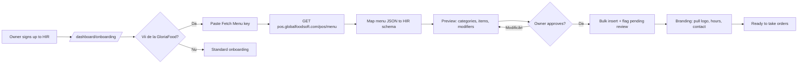

# GloriaFood Competitive Analysis & HIR Migration Plan

**Author:** HIR Restaurant Suite team
**Date:** 2026-04-28
**Status:** Internal research — do not distribute
**Branch:** `docs/gloriafood-competitive-analysis`

---

## Executive summary

GloriaFood (gloriafood.com) is the most direct competitor we have. Founded in Bucharest, acquired by Oracle in 2018 (Oracle Hospitality / Simphony POS), it is a SaaS online-ordering platform for **single restaurants and small chains** with three durable advantages we have to respect: a **forever-free** core tier with unlimited orders and zero commissions, a polished **embeddable widget** that drops into any existing website, and a **mature merchant order-taking app** that has been iterated on since 2014. They publish a documented integration API (`pos.globalfoodsoft.com`) including a **Fetch Menu API** that, given owner consent, lets a third party pull the entire restaurant menu — categories, items, prices, sizes, modifiers, allergens, nutritional values. That is the door we use to build "Move from GloriaFood in 5 minutes."

**Top 5 features HIR has that GloriaFood lacks (offensive):**

1. **AI CEO Copilot** — operator-facing copilot reading P&L, menu performance and order data. GloriaFood has no LLM-driven advisor.
2. **Native multi-tenant SaaS with proper centralized dashboard** — multi-location is the loudest gap in GloriaFood reviews; they admit "we don't yet have a management dashboard for multiple accounts."
3. **Real KDS web app** with print-ready ticket route (`/kds`, `/kds/print/[id]`) — GloriaFood relies on the order-taking phone/tablet plus optional Star/Epson printers.
4. **First-class custom-domain storefront** with Vercel domain provisioning, SEO settings, branded site — GloriaFood's website builder is rigid and reviewers complain it makes "all restaurants menus look the same."
5. **Open delivery & dispatch architecture** — courier app, multi-fleet webhook, integration-dispatcher edge function, GPS trip tracking. GloriaFood does no delivery dispatch; it leaves logistics to the restaurant or to bolt-on POS partners.

**Top 5 features GloriaFood has that HIR lacks (defensive backlog):**

1. **Autopilot** — pre-built automated email/SMS lifecycle campaigns (cart abandonment, second-order, win-back, birthday).
2. **Branded mobile app for end customers** ($59/mo) — submitted to App Store / Play Store on the restaurant's behalf.
3. **Online reservations/table booking widget** with optional deposits ($0.50/guest).
4. **Heatmap of delivery requests outside the delivery zone** — used to optimize zones; reviewers love this.
5. **Flyer generator + Google ranking scanner + customer invitation tools** — small things that ship in their free tier and create stickiness.

**Migration angle (one line):** Use GloriaFood's public **Fetch Menu API v2** with an owner-supplied secret key to import the full menu graph (categories, items, sizes, modifiers, allergens, nutritional values, kitchen internal names) into a HIR tenant in <5 min, then surface a guided "review & approve" flow on `/dashboard/onboarding`.

---

## 1. Who is GloriaFood

| Attribute | Value |
|---|---|
| Legal owner | Oracle Hospitality (acquired 2018) |
| Domain | gloriafood.com |
| Origin | Bucharest, Romania |
| Customer base | Marketing copy claims 100k+ restaurants in 180+ countries |
| Capterra rating | 4.6–4.7 / 5 across 57–68 reviews depending on snapshot [^cap] |
| G2 rating | 4.7 / 5 across 19 verified reviews [^g2] |
| Trustpilot | ~271 reviews, generally positive [^tp] |
| Pricing model | Forever-free core + paid add-ons |
| Free-tier promise | "Unlimited orders, unlimited locations, no commission per order, no monthly fee" [^pricing] |

The forever-free pitch is what kills competitors at the bottom of the market. Anyone selling a $30/mo SaaS to an independent restaurant in 2026 is competing against GloriaFood's free tier. Our positioning has to be: **"GloriaFood is free until you actually want to grow."**

---

## 2. Pricing structure (verbatim)

From `gloriafood.com/pricing` [^pricing]:

| Item | Price | Notes |
|---|---|---|
| Online ordering core | **$0 / month** | Free, unlimited orders, unlimited locations, no commission |
| Online/Credit-Card Payments | **$29 / month** | Stripe-style payment routing |
| Restaurant POS System | **$49 / month / location** | 2-year commitment |
| Table Reservation Deposits | **$0.50 / guest** | Per accepted booking |
| Advanced Promo Marketing | **$19 / month** | Lifecycle campaigns / Autopilot |
| Sales-Optimized Website | **$9 / month** | Their "money-making website" upsell |
| Branded Mobile Apps | **$59 / month** | iOS + Android, app-store submission included |

Total cost for a "fully loaded" GloriaFood tenant: **$165 / month / location** + $0.50 per reservation. A small chain (3 locations) running fully-loaded pays roughly **$280–$330 / month** in add-ons (POS scales per location, others are flat).

That is HIR's sweet spot. Our package B (B = delivery + white-label app, our flagship) targets the same wallet share.

---

## 3. Feature catalog (the meat)

The table is grouped by area. Columns:

- **Feature** — GloriaFood terminology with HIR translation in parens
- **Tier** — Free / paid add-on price
- **HIR has it?** — Yes / Partial / No
- **Effort to match** — S (≤3 days), M (1–2 weeks), L (≥3 weeks)
- **Priority** — P0 must-have / P1 nice-to-have / P2 ignore

### 3.1 Menu management

| Feature | Tier | HIR has it? | Effort | Priority |
|---|---|---|---|---|
| Drag-and-drop visual menu editor | Free | Yes | – | – |
| Categories | Free | Yes | – | – |
| Modifiers / option groups (force_min/force_max) | Free | Partial — option groups exist; no `force_min/force_max` enforcement on storefront | M | P0 |
| Sizes (default size flag, per-size pricing) | Free | Partial — single price per item today | M | P1 |
| Item allergen icons (HOT, VEGETARIAN, VEGAN, GLUTEN_FREE, HALAL, NUT_FREE, DAIRY_FREE, RAW) [^fetchmenu] | Free | No | S | P0 |
| Nutritional values per item / per size | Free | No | M | P2 |
| Kitchen-internal-name (separate name on KDS ticket) | Free | No | S | P1 |
| Free stock photo library for items | Free | No | M | P2 |
| Mark item / size / option sold out (until tomorrow / specific date / indefinite) | Free | Partial — sold-out flag only | S | P0 |
| Per-order-type item availability (`menu_item_order_types`) | Free | No | M | P1 |
| Multi-language menu | Paid (Sales-Optimized Website tier) [unconfirmed] | No | L | P1 |
| Scheduled menu (different menu by daypart) | Free | No | M | P1 |

### 3.2 Order management

| Feature | Tier | HIR has it? | Effort | Priority |
|---|---|---|---|---|
| Real-time order notification on operator phone | Free | Yes (notify-new-order) | – | – |
| Accept / reject with custom reason | Free | Yes (basic accept/reject) | – | – |
| Auto-print on supported printer (Star/Epson) [^orderapp] | Free | No | L | P1 |
| Order grouping by status (All / In Progress / Ready) | Free | Yes (`/dashboard/orders`) | – | – |
| Swipe-to-ready on mobile order app | Free | No (no native app yet) | L | P1 |
| Out-of-stock from operator app | Free | Partial | S | P0 |
| Pause services with customer-facing message | Free | Partial (operations settings) | S | P0 |
| Test-order generator | Free | No | S | P2 |
| Connectivity status indicator (login / internet / restaurant) | Free | No | S | P2 |
| Scheduled / pre-orders (customer picks delivery time) | Free | Partial (checkout has timing) | M | P0 |
| Order ahead for table reservations | Free | No | M | P1 |
| Group orders | [unconfirmed] | No | L | P2 |

### 3.3 Promotions

| Feature | Tier | HIR has it? | Effort | Priority |
|---|---|---|---|---|
| Promo code | Free | Yes | – | – |
| Percentage off | Free | Yes | – | – |
| Fixed amount off | Free | Yes | – | – |
| Free item with order | Free | Partial | M | P1 |
| BOGO (buy one get one) | Free | No | M | P1 |
| First-time-buyer discount | Free | No | S | P0 |
| Second-order discount | Paid (Advanced Promo $19) | No | S | P1 |
| Online punch card (e.g. "5 orders → free dessert") | Paid (Advanced Promo) | No | M | P1 |
| Time-limited / scheduled promo | Free | Partial | S | P0 |
| Free-delivery promo (% only — fixed not supported [^cap]) | Free | Yes | – | – |
| Customer-segment-targeted promo (purchase history) | Paid | No | L | P1 |
| Lifecycle promos (cart abandonment, win-back) — Autopilot | Paid (Advanced Promo) | No | L | P0 |
| Birthday promo | Paid [unconfirmed] | No | M | P1 |
| Referral program | [unconfirmed] | No | M | P1 |

### 3.4 Marketing automation

| Feature | Tier | HIR has it? | Effort | Priority |
|---|---|---|---|---|
| Email blasts to customer list | Paid (Advanced Promo / Autopilot) | Partial — newsletter resend in flight (`feat/newsletter-resend`) | M | P0 |
| Push notifications via branded app | Paid (Branded App $59) | No | L | P1 |
| Cart-abandonment recovery email/SMS | Paid (Autopilot) | No | M | P0 |
| Win-back / re-engage inactive customers | Paid (Autopilot) | No | M | P0 |
| Encourage second order | Paid (Autopilot) | No | S | P0 |
| Birthday automation | Paid [unconfirmed] | No | M | P1 |
| Customer invitations / "invite a friend" | Free | No | S | P2 |
| Flyer generator (printable promo flyers) | Free | No | M | P2 |
| Website rank checker / Google listing analysis | Free | No | M | P2 |

### 3.5 Customer experience

| Feature | Tier | HIR has it? | Effort | Priority |
|---|---|---|---|---|
| Online reservations widget | Free | No | M | P0 |
| Reservation deposits | Paid ($0.50/guest) | No | M | P1 |
| Table-by-table QR-code dine-in ordering [^qr] | Free | Partial (no table-tagging on order yet) | M | P0 |
| Order ahead for reservations | Free | No | M | P1 |
| Order status tracking page for customer | Free [unconfirmed] | Yes (`/track/[token]`) | – | – |
| Single-page checkout | Free | Yes | – | – |
| Saved customer info (recognition cookie) | Free | Yes | – | – |
| Customer account / login | Free [unconfirmed] | Yes (`/account`) | – | – |
| Multi-language storefront widget | Paid [unconfirmed] | Partial (i18n scaffolded) | M | P1 |
| Contactless delivery / pickup options | Free | Yes | – | – |
| Customer order-status SMS / email | Free | Yes (notify-customer-status) | – | – |

### 3.6 Storefront & branding

| Feature | Tier | HIR has it? | Effort | Priority |
|---|---|---|---|---|
| Embeddable widget for any website | Free | No (we own the storefront) | L | P1 |
| Standalone restaurant website (templated) | Paid ($9/mo Sales-Optimized) | Yes (`restaurant-web` tenant storefront) | – | – |
| Custom domain | Paid [unconfirmed] | Yes (`/dashboard/settings/domain`) | – | – |
| Branding (logo, color, slogan) | Free | Yes (`/dashboard/settings/branding`) | – | – |
| SEO settings page | [unconfirmed] | Yes (`/dashboard/settings/seo`) | – | – |
| Mobile-responsive | Free | Yes | – | – |
| Facebook ordering link / smart-link | Free | Partial (storefront URL works but no FB integration) | S | P2 |
| Branded mobile app for customers | Paid ($59/mo) | No | L | P1 |
| QR code for menu | Free | Partial (`/m/[slug]` exists) | S | P0 |
| WordPress / Wix / Squarespace integration | Free | No | M | P2 |

### 3.7 Integrations

| Feature | Tier | HIR has it? | Effort | Priority |
|---|---|---|---|---|
| Public Fetch Menu API | Free | Partial (`packages/integration-core` exists) | M | P0 |
| Public Accept Orders API (push & poll) | Free | Partial (integration-dispatcher edge fn) | M | P0 |
| POS partner integrations (SambaPOS, Simphony, etc.) | Paid (POS $49/mo) | Partial (delivery-client + integration-core scaffolding) | L | P1 |
| Stripe / payment processor | Paid ($29/mo) | Partial | M | P0 |
| Zapier | [unconfirmed] | No | M | P2 |
| Accounting integrations | [unconfirmed] | No | L | P2 |
| Third-party delivery (Glovo / Wolt / Bolt / Tazz) | No (out of scope for them) | Partial (multi-fleet courier webhook in flight) | L | P0 |

### 3.8 Analytics

| Feature | Tier | HIR has it? | Effort | Priority |
|---|---|---|---|---|
| Sales reports | Free | Yes (`/dashboard/analytics`) | – | – |
| End-of-day reporting | Free | Yes (daily-digest edge fn) | – | – |
| Item performance | Free | Partial | S | P1 |
| Customer insights (LTV, frequency) | Paid [unconfirmed] | No | M | P1 |
| Peak hours / heatmap | Free | No | M | P1 |
| **Heatmap of delivery requests outside zone** | Free | No | M | P0 |
| Promo performance reporting | Paid | No | M | P1 |
| Website rank checker | Free | No | M | P2 |
| AI CEO copilot (LLM-driven advisor) | – | Yes (`apps/copilot`) | – | – |

### 3.9 Multi-location

| Feature | Tier | HIR has it? | Effort | Priority |
|---|---|---|---|---|
| Unlimited locations | Free | Yes (multi-tenant) | – | – |
| **Centralized chain dashboard** | Not yet — admitted gap [^chain] | Yes | – | – |
| Per-location separate login | Free (forced) | Optional | – | – |
| Per-location menu | Free | Yes | – | – |
| Central menu push to N locations | No [^chain] | Partial | M | P0 |
| Location-aware delivery zones | Free | Yes | – | – |
| Headquarter website (list all locations) | "coming soon" [^chain] | Partial (corporate site separate) | M | P1 |

### 3.10 Operations

| Feature | Tier | HIR has it? | Effort | Priority |
|---|---|---|---|---|
| Vacation mode | Free | Partial (operations settings) | S | P0 |
| Out-of-stock per item | Free | Partial | S | P0 |
| Opening hours | Free | Yes | – | – |
| Holiday hours | Free | Partial | S | P0 |
| Pause services with customer message | Free | Partial | S | P0 |
| Delivery area drawing on map | Free | Yes (`/dashboard/zones`) | – | – |
| Per-zone delivery fee | Free | Yes | – | – |
| Per-zone min order | Free | Yes | – | – |
| **Per-day-of-week zone rules** | No (frequent complaint [^g2]) | No | M | P1 — beat them here |
| Driving-distance-based delivery fee | No (#1 complaint [^g2]) | Partial (`packages/delivery-client`) | M | P0 — beat them here |

### 3.11 Trust & compliance

| Feature | Tier | HIR has it? | Effort | Priority |
|---|---|---|---|---|
| Allergen labels | Free | Partial | S | P0 |
| Tax / VAT handling | Free [unconfirmed] | Yes | – | – |
| GDPR-compliant data export | [unconfirmed] | Yes (legal/privacy page exists) | – | – |
| Refund flow | Free [unconfirmed] | Partial | M | P1 |
| Audit log | [unconfirmed] | Yes (`/dashboard/settings/audit`) | – | – |

### 3.12 Notifications

| Feature | Tier | HIR has it? | Effort | Priority |
|---|---|---|---|---|
| Operator phone push (in-app) | Free | Partial — web push only | L | P1 |
| Operator phone alarm with forced volume [^cap] | Free (controversial — many complain) | No (good — don't replicate the complaint) | – | – |
| Kitchen printer auto-print | Free (paid printer required) | No | L | P1 |
| Customer SMS on status change | Free [unconfirmed] | Yes | – | – |
| Customer email on status change | Free | Yes | – | – |
| Daily digest email | [unconfirmed] | Yes (daily-digest edge fn) | – | – |
| Review reminder email | [unconfirmed] | Yes (review-reminder edge fn) | – | – |

**Total rows: 95+**

---

## 4. Per-area deep dive

### 4.1 Menu management

GloriaFood's menu model is mature and worth copying line-for-line. The Fetch Menu v2 schema [^fetchmenu] shows three layers we should match exactly because it makes import lossless: `category → item → size`, plus orthogonal `option group → option` that can be attached to a category, item, or size. This is more flexible than a flat "modifiers per item" model.

Their tag enum is fixed: `HOT, VEGETARIAN, VEGAN, GLUTEN_FREE, HALAL, NUT_FREE, DAIRY_FREE, RAW`. Adopt this enum verbatim — restaurants migrating from GloriaFood will assume their tags survive.

`force_min` and `force_max` on option groups are first-class. We should treat option group cardinality as a hard validation rule on storefront, not soft. GloriaFood reviewers complain about menu visual rigidity ("all restaurants menus do not look the same" [^cap]) but never about menu data model — that part is solid.

### 4.2 Order management

The order-taking app is GloriaFood's crown jewel. Reviewers consistently rank it as their favorite feature, with the caveat of the "obnoxious" forced-volume alarm [^cap]. From [^orderapp]:

- Three buckets: All / In Progress / Ready
- Swipe-right to advance status
- Auto-print integration with named printers
- "Mark sold out until tomorrow / specific date / indefinitely" — this 3-option dropdown is a small UX detail that should be stolen exactly
- Pause services with optional customer message
- Connectivity adviser ("Fix This")

We should ship a **PWA order-taking mode** (mobile-optimized `/dashboard/orders` route) before building a native app. The PWA covers 95% of the use case at 5% of the maintenance cost.

### 4.3 Promotions & Autopilot

The free promo engine covers percentage, fixed, free-item, free-delivery, first-time, and time-windowed. The **Advanced Promo / Autopilot** paid tier ($19/mo) [^marketing] adds:

- Cart-abandonment recovery (email + SMS)
- Second-order encouragement
- Win-back of inactive customers
- Customer-segment targeting by purchase history
- Online punch cards ("5 orders → free dessert")

This is the single biggest defensive gap. Cart abandonment alone is industry-standard table stakes in 2026. Build it in Faza 2 (see backlog).

A concrete weakness: GloriaFood does **not** support a fixed-dollar discount on delivery fees, only percentage [^cap]. We can ship fixed-amount delivery promos in a sprint and use it as a sales talking point.

### 4.4 Marketing automation

Beyond Autopilot, GloriaFood has a set of small free utilities that drive stickiness:

- **Flyer generator** — produces a printable PDF promo flyer
- **Customer invitations** — operator can send "invite to order" emails to a list
- **Website rank checker** — scrapes Google for the restaurant's local rank
- **Google listing analysis** — checks GMB completeness

None are individually critical, but together they create the "I have a marketing toolkit" feeling. Our newsletter feature in flight (`feat/newsletter-resend`) covers email blasts. We should add at least the flyer generator before TEI close — it is a 1-day Canva-template-with-substitution build and produces a tangible artifact pharmacists/restaurateurs love showing customers.

### 4.5 Customer experience — reservations & QR

**Reservations** is a free GloriaFood feature with a paid deposit add-on ($0.50/guest). Reviewers regularly cite reservations as the reason they chose GloriaFood over a pure-ordering competitor. We do not have reservations at all today. This is P0 for HIR Restaurant Suite — it is the single feature that turns a delivery-only platform into a full restaurant suite.

**QR-code dine-in** [^qr] is also free. Their flow:

1. Operator generates QR code (single or per-table)
2. Customer scans, lands on menu, orders, optionally pays
3. Order routes to kitchen with table tag

Our `/m/[slug]` route is a partial. We are missing the table-tagging step. Small fix (S effort).

### 4.6 Storefront — the rigidity advantage

GloriaFood's biggest reviewable weakness is **menu visual rigidity**. Quotes from Capterra [^cap]:

- "All restaurants menus do not look the same"
- "Limited customization options for menu appearance"
- "Black-boxed ordering plugin"

Their widget is locked to their CSS. We own the storefront end-to-end — different fonts, different layouts, different hero images per tenant. This is our offensive angle: **"GloriaFood gives you a standardized widget. We give you a real website."**

The flip side: their widget works on **anyone's existing site** — WordPress, Wix, Squarespace, plain HTML. We currently require the restaurant to redirect to `[tenant].hir.ro`. Building an embed widget (P1) is on the backlog.

### 4.7 Integrations & API

GloriaFood publishes their integration spec on GitHub at `GlobalFood/integration_docs` [^api]. Three APIs:

- **Fetch Menu API v2** [^fetchmenu] — `GET https://pos.globalfoodsoft.com/pos/menu`. Auth: per-restaurant secret in `Authorization` header. Format: JSON or XML, controlled by `Accept` header. Returns the full menu graph.
- **Accept Orders API v2** [^acceptedorders] — Two modes: **Push** (webhook) and **Poll**. Push delivers JSON/XML order payloads to a partner-provided HTTPS endpoint with a master key in `Authorization`. 15-second response SLA, with required idempotency on `(order_id, pos_system_id)`.
- **Client Payments API** [^clientpayments] — marked "Work in progress" in their repo.

The auth model is critical: every key is **per-restaurant-location, generated by the owner from Restaurant Admin Panel → Others → 3rd party integrations → Enabled integrations menu, template "Fetch Menu"**. This is an explicit owner-consent flow. There is no OAuth, no rate limit documented, no scopes. The owner generates a key, pastes it into our import flow, we pull. Done.

This makes our migration UX clean — no "log in to GloriaFood and authorize HIR via OAuth" dance, just paste a key.

### 4.8 Analytics

Their analytics is fine but not differentiated. The one feature that consistently shows up in reviews as "wow, didn't expect this" is the **heatmap of delivery requests outside the delivery zone** — a map of would-be customers who tried to order but were outside the radius. Restaurant owners use it to redraw zones. P0 backlog item; we already capture address data on order attempts so the data exists.

Our **AI CEO Copilot** is the single biggest differentiator we own that has no GloriaFood equivalent. Use it in every demo.

### 4.9 Multi-location — their loudest gap

From a search-aggregated review summary [^chain]:

> "GloriaFood does not yet have a management dashboard for multiple accounts. Each location has its own separate login account and separate orders taking device, meaning that for a 3 location restaurant you have to have/buy 3 tablets/smartphones."

> "GloriaFood is currently working on offering a 'headquarter-website' that lists all the locations in one place, but this feature is still coming."

Our multi-tenant model is centralized by construction. Demo line: **"You have 3 locations? Open one tab. Done."**

### 4.10 Operations — the delivery-fee complaint

The #1 complaint in reviewers across G2 and Capterra is **delivery fee can't be calculated by actual driving distance, only by zone polygon** [^g2]. Our `packages/delivery-client` already speaks to mapping providers. Shipping a driving-distance fee tier (S–M effort) is both a P0 backlog item and a marketing moment.

The #2 complaint is **delivery zone rules don't vary by day-of-week or time** [^g2] — e.g. "Wednesdays we don't deliver to zone B because driver X is off." Same fix area, slightly more work.

### 4.11 Trust & compliance

GloriaFood doesn't market a strong compliance story. ANPC / GDPR / Romanian-specific tax rules are not in their docs publicly. We can lead with HIR's CUI (RO46864293) and DPO posture as a sales differentiator for Romanian customers — small but real.

### 4.12 Notifications

The "obnoxious order alarm" is a famous GloriaFood complaint:

> "The notification/alert is a very obnoxious sound...it doesn't matter if you mute device" [^cap]

GloriaFood forces a maximum-volume alarm and refuses to make it user-controllable. Reviewers describe their developers as "arrogant" for this. **Don't replicate this.** Our notification UX should be configurable from day 1 and we should explicitly market it: "You control the volume. Always."

---

## 5. HIR offensive angles (features we have that GloriaFood lacks)

| # | HIR feature | GloriaFood has? | Sales positioning |
|---|---|---|---|
| 1 | **AI CEO Copilot** (`apps/copilot`) | No | "GloriaFood gives you reports. HIR gives you a CFO." |
| 2 | **Centralized multi-tenant dashboard** | Admitted gap [^chain] | "Run 10 locations from one tab. GloriaFood needs 10 tablets." |
| 3 | **Web-based KDS** (`/kds`, print route) | No web KDS — paid POS only | "Your line cooks see orders on a $200 monitor, not a $0.50/order POS rental." |
| 4 | **Custom-domain storefront with full control** | Locked widget | "GloriaFood widget = same look as 100k other restaurants. HIR = your brand, your fonts, your hero." |
| 5 | **Driving-distance delivery fee** (when shipped) | No (#1 complaint) | Direct attack on their loudest review weakness. |
| 6 | **Day-of-week zone rules** (when shipped) | No (#2 complaint) | Same. |
| 7 | **Configurable operator notification volume** | Forced-loud, can't mute | "Your phone, your rules." |
| 8 | **Open courier app + multi-fleet dispatch** | Out of scope | "GloriaFood makes you call the driver. HIR routes the driver." |
| 9 | **Romanian-localized compliance** (CUI, ANPC, DPO) | Generic | Selling local trumps selling global, in Romania. |

---

## 6. HIR defensive backlog (12–20 prioritized items)

Phases align with `pharmacy-saas-phase1` Faza 1/2/3/4 conventions but applied to restaurant suite.

| # | Feature | GloriaFood ref | Effort | Phase |
|---|---|---|---|---|
| 1 | **Online reservations widget** | reservations + deposits | M | Faza 1 |
| 2 | **Cart-abandonment recovery email/SMS** | Autopilot | M | Faza 1 |
| 3 | **Allergen icons (8-tag enum)** + storefront filtering | menu_item_tags | S | Faza 1 |
| 4 | **Item sizes with per-size pricing** | sizes[] | M | Faza 1 |
| 5 | **Option group force_min/force_max enforcement** | groups[] | M | Faza 1 |
| 6 | **First-time-buyer discount preset** | first-time-buyer promo | S | Faza 1 |
| 7 | **Driving-distance delivery fee** | (their gap) | M | Faza 1 |
| 8 | **Heatmap of out-of-zone order attempts** | heatmap | M | Faza 1 |
| 9 | **Win-back / second-order automation** | Autopilot | M | Faza 2 |
| 10 | **Branded customer mobile app** (PWA first, native later) | Branded App $59 | L | Faza 2 |
| 11 | **Order-taking PWA optimized for tablet** | order-taking app | M | Faza 2 |
| 12 | **Receipt printer integration (Star/Epson)** | auto-print | L | Faza 2 |
| 13 | **Embeddable widget for any website** | their core widget | L | Faza 2 |
| 14 | **Order-ahead for reservations** | "order ahead" | M | Faza 2 |
| 15 | **Online punch-card promos** | Advanced Promo | M | Faza 3 |
| 16 | **Customer-segment targeting** | Advanced Promo | L | Faza 3 |
| 17 | **Birthday automation** | [unconfirmed Autopilot] | M | Faza 3 |
| 18 | **Flyer generator** | flyer generator | S | Faza 3 |
| 19 | **Multi-language storefront** | (paid tier) | M | Faza 3 |
| 20 | **Day-of-week zone rules** | (their gap) | M | Faza 3 |
| 21 | **Scheduled menu (daypart switching)** | scheduled menu | M | Faza 4 |
| 22 | **Hotel ordering mode** | hotel ordering system | L | Faza 4 — never unless asked |

---

## 7. Migration playbook — "Move from GloriaFood in 5 minutes"

### 7.1 Feasibility

The Fetch Menu v2 API [^fetchmenu] makes this technically clean. Owner consent is explicit (key generated in their admin panel). No OAuth dance. Single GET request returns the full menu graph in JSON.

### 7.2 Onboarding flow



### 7.3 Schema mapping

| GloriaFood field | HIR field | Notes |
|---|---|---|
| `categories[].id` | `menu_categories.gloriafood_id` (new column) | Keep for back-reference |
| `categories[].name` | `menu_categories.name` | Direct |
| `items[].id` | `menu_items.gloriafood_id` | Keep |
| `items[].name` | `menu_items.name` | Direct |
| `items[].description` | `menu_items.description` | Direct |
| `items[].price` | `menu_items.price` | Direct (assume currency from `menu.currency`) |
| `items[].sizes[]` | `menu_item_sizes` (new table) | New entity, P0 backlog #4 |
| `items[].groups[]` → `options[]` | `menu_modifier_groups` + `menu_modifiers` | Existing partial — extend with `force_min/force_max` |
| `items[].tags[]` | `menu_items.tags` (text[] enum) | New — backlog #3 |
| `items[].extras.menu_item_allergens_values[]` | `menu_items.allergens` (jsonb) | Direct |
| `items[].extras.menu_item_nutritional_values[]` | `menu_items.nutritional_values` (jsonb) | Direct |
| `items[].extras.menu_item_kitchen_internal_name` | `menu_items.kitchen_name` | Direct |
| `items[].extras.menu_item_order_types[]` | `menu_items.allowed_order_types` (text[]) | Direct |
| `groups[].force_min` / `force_max` | `menu_modifier_groups.min_select` / `max_select` | Direct |
| `currency` | `tenant_settings.currency` | Direct |

### 7.4 Order-management migration (Phase 2)

Same auth model with the **Push Accepted Order** template generates a different key. The owner can dual-route orders during a transition: GloriaFood widget keeps running, our integration-dispatcher receives the push, we mirror orders into HIR for unified analytics. Once the owner is comfortable, they swap their site embed from GloriaFood widget → HIR widget and turn off the dual-route.

### 7.5 What we cannot import via API

- Customer database (no public API)
- Promo configuration (no public API)
- Reservations (no public API)
- Order history beyond the live push window
- Branded mobile app data

For these we provide a **CSV import** (manual export from GloriaFood admin → upload to HIR). Effort: M.

### 7.6 Effort estimates

| Phase | Scope | Effort |
|---|---|---|
| 1 | Fetch Menu API client + schema mapping + import preview UI | M (1 sprint) |
| 2 | Schema additions (sizes, allergens, force_min/max, tags) | S–M |
| 3 | Order-push dual-route via integration-dispatcher | M |
| 4 | CSV importer for customers / promos / reservations | M |
| 5 | "Move from GloriaFood" landing page + onboarding CTA | S |
| **Total** | | **~6 weeks 1 dev** |

### 7.7 Marketing artifact

Single landing page at `hir.ro/migrate-from-gloriafood`:

- Hero: "Mută-te de la GloriaFood în 5 minute"
- 3-step flow visualization
- Comparison table (subset of section 3 above)
- Single CTA: "Începe migrarea" → onboarding flow with GloriaFood prefill

---

## 8. Pricing comparison & HIR positioning

### 8.1 Side-by-side

| Tier | GloriaFood | HIR Restaurant Suite (proposed) |
|---|---|---|
| Free / starter | $0 + unlimited orders | Limited storefront + ordering, branded HIR domain only |
| Mid | ~$57/mo (Promo $19 + Website $9 + Payments $29) | Package A — delivery + ordering, EUR equivalent ~€60/mo |
| Flagship | ~$116/mo (+ Branded App $59) | **Package B** — delivery + white-label app, AI CEO copilot, custom domain |
| Enterprise / chain | $49/loc/mo POS + everything else | **Package C** — full suite + multi-location dashboard + integrations |

### 8.2 Where we win on price-feature ratio

- **Multi-location**: GloriaFood charges $49/loc/mo for POS-driven central management. HIR's centralized dashboard is included in Package B and above, no per-location markup on the dashboard itself.
- **AI CEO Copilot**: priced into Package B, no GloriaFood equivalent.
- **Native delivery fleet management**: GloriaFood doesn't sell this at all.

### 8.3 Where they win

- **The free tier**. Period. Anyone with <50 orders/day will pick GloriaFood until we have a free tier of our own. Recommendation: ship a HIR-branded free tier (HIR domain, HIR-branded checkout footer) with hard caps (e.g. 100 orders/mo, 1 location, no AI CEO). Goal is foot-in-the-door, not revenue.

### 8.4 Recommended HIR pricing tweaks

1. **Add a free tier** with strict caps. Without it we lose every "I'm just trying ordering for the first time" lead to GloriaFood.
2. **Drop a "Migrating from GloriaFood" 3-month 50%-off promo code** to neutralize switching cost.
3. **Per-location pricing on Package C should NOT be linear** — discount aggressively at 5+ locations to land chains GloriaFood admittedly can't serve well [^chain].

---

## 9. Order-management state-machine comparison

```
GloriaFood:
  NEW → ACCEPTED → IN_PROGRESS → READY → COMPLETED
                 ↘ REJECTED (with reason)
  (no driver dispatch states — handoff to "the driver" is not modeled)

HIR (current, simplified):
  NEW → CONFIRMED → IN_KITCHEN → READY_FOR_PICKUP →
        OFFER_PENDING → COURIER_ASSIGNED →
        PICKED_UP → IN_TRANSIT → DELIVERED
                 ↘ CANCELLED
                 ↘ FAILED_DELIVERY
```

HIR has 4–5 more states because we model dispatch. This is an architectural advantage — GloriaFood can never bolt on real dispatch without a major rewrite of the order entity.

---

## 10. Sources

[^pricing]: GloriaFood pricing page, https://www.gloriafood.com/pricing — fetched 2026-04-28.
[^fetchmenu]: GlobalFood Integration APIs, Fetch Menu API v2, https://github.com/GlobalFood/integration_docs/blob/master/fetch_menu/README.md — fetched 2026-04-28.
[^acceptedorders]: GlobalFood Accepted Orders API v2, https://github.com/GlobalFood/integration_docs/blob/master/accepted_orders/README.md — fetched 2026-04-28.
[^clientpayments]: GlobalFood Client Payments API, https://github.com/GlobalFood/integration_docs/blob/master/client_payments/README.md — "Work in progress."
[^api]: GlobalFood Integration APIs root, https://github.com/GlobalFood/integration_docs.
[^marketing]: GloriaFood Restaurant Marketing, https://www.gloriafood.com/restaurant-marketing — Autopilot, Promotions, Kick-starter modules.
[^cap]: Capterra GloriaFood reviews, https://www.capterra.com/p/198378/GloriaFood/reviews/ — 4.7/5, 57+ reviews; verbatim complaints quoted.
[^g2]: G2 GloriaFood reviews, https://www.g2.com/products/gloriafood/reviews — 4.7/5, 19 reviews; delivery-fee and zone-rules complaints.
[^tp]: Trustpilot GloriaFood, https://www.trustpilot.com/review/www.gloriafood.com — 271 reviews [403 on direct fetch; sentiment captured via search aggregation].
[^chain]: GloriaFood multi-location dashboard limitations, search-aggregated from gloriafood.com FAQ and third-party comparisons (RestoLabs, Saaztro). Verbatim: "GloriaFood does not yet have a management dashboard for multiple accounts."
[^orderapp]: GloriaFood order-taking app, https://www.gloriafood.com/order-taking-app-for-restaurants — auto-print, bucket grouping, swipe-to-ready, pause services.
[^qr]: GloriaFood QR code dine-in, https://www.gloriafood.com/qr-code-ordering — per-table codes, payment-at-table, kitchen routing.

### Other sources consulted

- GloriaFood homepage navigation, https://www.gloriafood.com/
- GloriaFood Online Ordering Software, https://www.gloriafood.com/online-ordering
- GloriaFood Online Food Ordering for Restaurants, https://www.gloriafood.com/online-food-ordering-system-for-restaurants
- GloriaFood Restaurant Website Builder, https://www.gloriafood.com/restaurant-website-builder
- GloriaFood Branded Mobile App, https://www.gloriafood.com/restaurant-mobile-app
- GloriaFood Restaurant App Features, https://www.gloriafood.com/restaurant-app-features
- GloriaFood Restaurant Management System Features, https://www.gloriafood.com/restaurant-management-system-features
- GloriaFood Restaurant Marketing Software, https://www.gloriafood.com/restaurant-marketing-software
- GloriaFood Loyalty references, https://www.gloriafood.com/restaurant-ideas/loyalty-program
- GloriaFood Multi-Restaurant Ordering, https://www.gloriafood.com/multi-restaurant-ordering-system
- GloriaFood Manage Multiple Accounts, https://www.gloriafood.com/manage-multiple-accounts
- GloriaFood Food Ordering API marketing page, https://www.gloriafood.com/restaurant-ordering-system-with-food-ordering-api
- GloriaFood iOS app release, https://www.gloriafood.com/ios-app-for-restaurants-release
- SambaPOS — GloriaFood integration setup, https://kb.sambapos.com/en/6-3-how-to-setup-gloriafood-online-ordering-integration-module/
- Oracle Simphony — GloriaFood integration guide, https://docs.oracle.com/en/industries/food-beverage/simphony/simgi/t_gf_setup.htm
- OrderingPlus migration help, https://help.orderingplus.com/en/articles/10064667-import-menus-from-gloriafood-to-orderingplus-within-minutes
- ApiTracker GloriaFood entry, https://apitracker.io/a/gloriafood
- gbro115/gloriafood-php (third-party PHP SDK), https://github.com/gbro115/gloriafood-php
- GetApp GloriaFood, https://www.getapp.com/retail-consumer-services-software/a/gloriafood/reviews/
- Software Advice GloriaFood, https://www.softwareadvice.com/retail/gloriafood-profile/reviews/
- SelectHub GloriaFood, https://www.selecthub.com/p/online-ordering-systems/gloriafood/
- FeaturedCustomers GloriaFood, https://www.featuredcustomers.com/vendor/gloriafood
- SourceForge GloriaFood, https://sourceforge.net/software/product/GloriaFood/
- Saaztro alternative comparison, https://www.saaztro.co/alternatives/global/gloriafood
- RestoLabs alternatives blog, https://www.restolabs.com/blog/gloria-food-alternatives
- GloriaFood Facebook multi-location post, https://www.facebook.com/Gloriafood/posts/introducing-multi-location-dashboard-for-complex-setups-of-restaurants-franchise/777341255779971/

---

## 11. Future research

Time-boxed at 120 minutes. Items deferred:

- **Help-center deep crawl** — `support.gloriafood.com` returned a connection error during this session; sample article titles came from Google search snippets, not direct crawl. Re-attempt with a residential proxy or off `support.gloriafood.com/hc/...` routes.
- **App Store + Play Store reviews** of "GloriaFood" merchant app — not crawled directly; sentiment captured via Capterra/G2 aggregations only.
- **Reddit + r/restaurantowners** — qualitative pain-point sweep.
- **YouTube tutorial walkthroughs** — no transcript scraped; would surface UX details we may have missed.
- **Reservations deep dive** — their reservations product page returned 404 on multiple URL guesses (`/online-reservations`, `/restaurant-table-reservations`, `/restaurant-reservation-system`). The actual page is reachable through nav as "Table Reservations" but the slug needs confirmation; book the deep dive when we start Faza 1 reservations build.
- **Confirm "[unconfirmed]" tags** in section 3 — birthday promo, referral, multi-language exact tier, customer LTV reporting. Most confirmable from a logged-in trial dashboard, which is out of scope per task constraints.

---

**End of document.**
